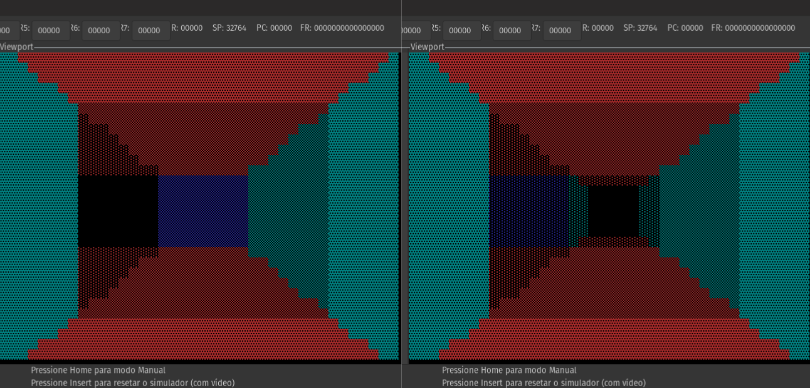

# 3D Labyrinth in Assembly

## Description

This repository contains the code for a 3D rendered labyrinth game developed in assembly to run in the the São Carlos Institute of Mathematical and Computing Sciences (ICMC) processor.

You can use the standard commands W, A, S, and D to move about the labyrinth searching for the exit, while the game re-renders the surrounding walls at each step. To make the process a bit harder, lighting is implemented so distant walls (from you) get darker and harder to see.



## Assembling and Simulation

To assemble the game and simulate it in the ICMC architecture I am using my own fork of those tools, found at [Processador ICMC](https://github.com/Guilherme-L-Schmidt/Processador-ICMC/tree/master/Simulator_Source). The correct assembler is found in the `NovoMontadorLinux/montadorLinux` folder, and the simulator in the `Simulator_Source` folder.
Both are modified to work correctly with negative numbers and to implement the NEG instruction (to store the negative of a given number in the register using the two's complement format).

`montador` is the assembler and `sim` is the simulator, both compatible primarily with Linux.

To start the game, assure that you have the files `sim` and `montador`, as found here and in the mentioned fork. Afterwards, use the following commands to assemble and run the game simulation:

```
./montador jogo_new.asm jogo_new.mif
./sim jogo_new.mif charmap.mif
```

## Ending notes

This project was developed as an evaluation method for the discipline SSC0902 - Computer Organization and Architecture, at the University of São Paulo. A higher resolution to the simulator and a labirynth generation algorithm would greatly benefit this project.
